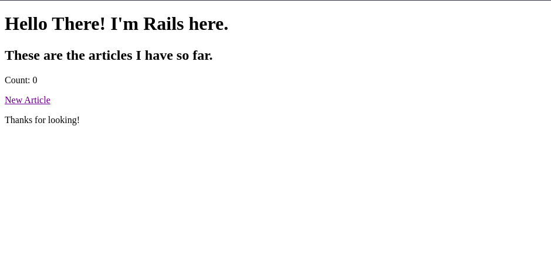
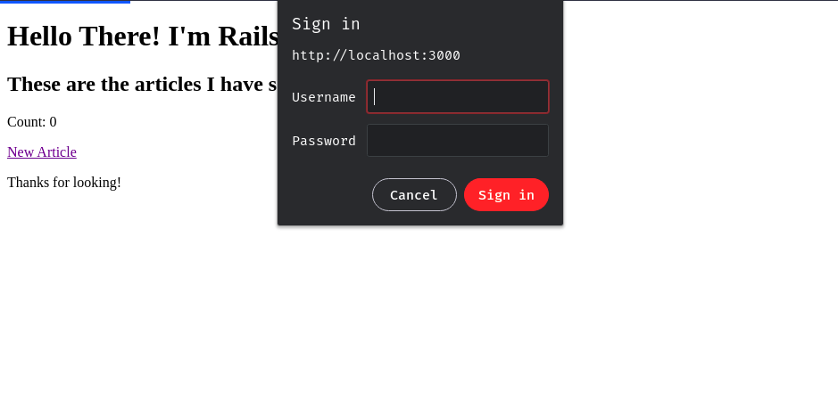
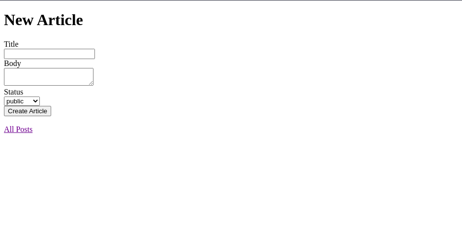
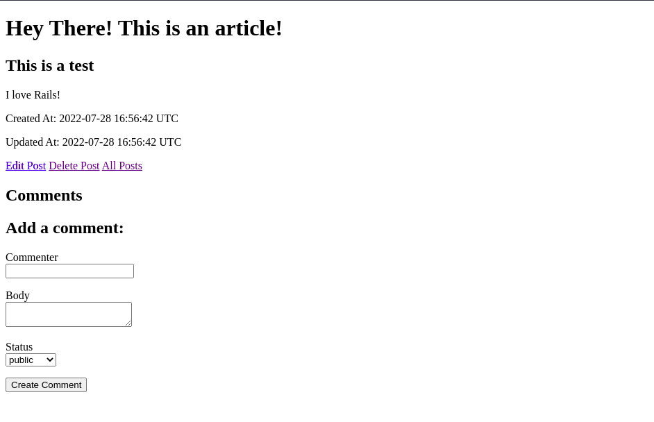
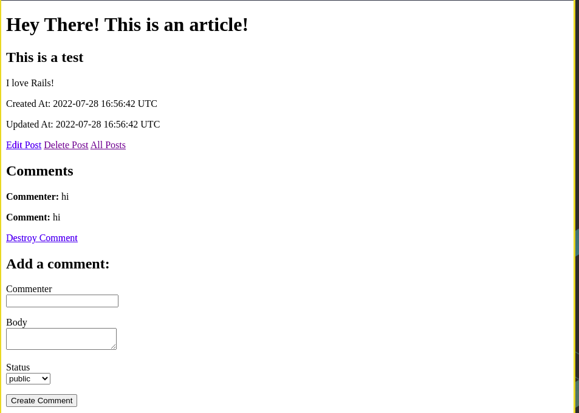
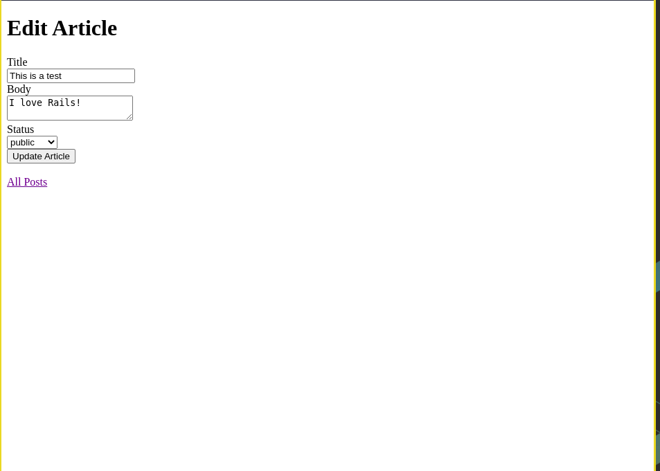

# [Rails-Blog](https://guides.rubyonrails.org/getting_started.html)

  
Table Of Contents

  <ol>
    <li>
      <a href="#description">Description</a>
    </li>
    <li>
      <a href="#demo">Demo</a>
    </li>
    <li>
      <a href="#built-with">Built With</a>
    </li>
     <li>
      <a href="#what-i-learned">What I Learned</a>
    </li>
     <li>
      <a href="#acknowledgements">Acknowledgements</a>
    </li>
  </ol>

## Description
A code along simple `Rails` Blog application to get used to `Rails` conventions and environment. I done this as part of [The Odin Project](https://theodinproject.com)'s Ruby On Rails curriculum. I don't know why but I love learning Ruby and Rails. But that doesn't mean I don't like other languages and frameworks. I love them too. But Ruby and Rails are special to me.

## Demo

  
Here are some sample images of the App (CRUD)

  
  
  
  
  
  
  

 
  
## Built With
* Rails 7.0.3.1
* Ruby 3.1.2

## Commands
Here are few `Rails` related commands
* `rails new <app-name>`
* `rails new --help`
* `rails server` alias `rails s`
* `rails generate <options>` alias `rails g <options>`
* `rails g controller <controller-name (plural)> <actions> <--skip-routes>`
* `rails routes <-c(controller)/-g(grep) (localhost:3000/rails/info)>`
* `rails g model <model-name (singular)> <field:datatype (multiple)>`
* `rails db`
* `rails db:migrate`
* `rails console` alias `rails c`
* `rails g migration <Name (e.g. AddStatusToArticles(auto detect table name as articles)> <changes>`
* We can also use `bin/rails`

## What I Learned
* Rails generators (commands) like `rails g model/controller` 
* Basic database migrations
* Using Model View Controller patterns
* Basic understanding of how Rails using `convention over configuration`
* Using `ERB` for rendering dynamic content within `HTML` using `ruby`
* Using view templates, layouts, partials to organize the Views part of MVC
* Difference between `render` and `redirect` in Controllers
* Generating resourceful routes
* Generating models with concerns for repetitive code 
  
## Acknowledgements
* [The Odin Project](https://theodinproject.com)
* [Rails Guides](https://guides.rubyonrails.org)

[Move To Top](#rails-blog)
